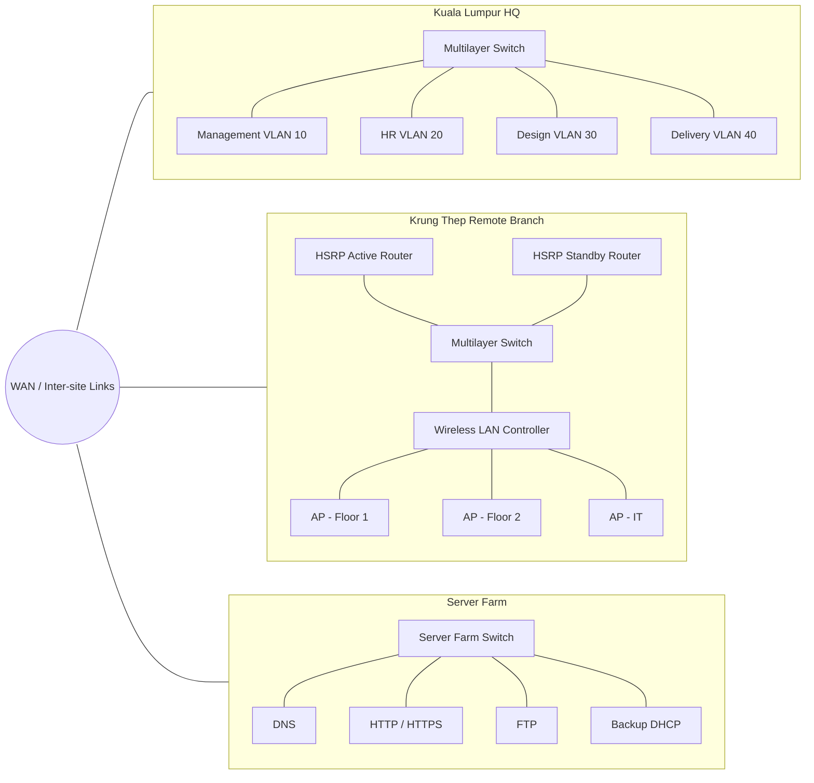

# Enterprise Network Resilience & Security Lab

> Personal Cisco Packet Tracer project demonstrating multi-site enterprise networking, high availability, dynamic routing, wireless management, server services, and Layer 2 security hardening.

## Overview

This repository documents a **personal network engineering lab** built around a simulated enterprise with:

- a **Kuala Lumpur headquarters**
- a **Krung Thep remote branch**
- a dedicated **server farm**

The goal is to design a network that is segmented, resilient, centrally manageable, and defensible against common Layer 2 attacks.

The lab combines routing, switching, redundancy, wireless networking, server services, and security controls in one Packet Tracer environment.

## What the lab demonstrates

- **VLAN segmentation** for departments, management, voice, native, and blackhole VLANs
- **Inter-VLAN routing** using multilayer switches
- **WAN connectivity** between HQ, remote branch, and server farm
- **OSPF** for dynamic route learning across sites
- **Wireless LAN Controller (WLC)** with centrally managed access points
- **DHCP** with primary and backup service concepts
- **EtherChannel** for link aggregation and redundancy
- **HSRP** for default-gateway/router failover
- **Spanning Tree Protocol (STP)** for Layer 2 loop prevention
- **DNS, HTTP/HTTPS, and FTP** services in a dedicated server farm
- **Layer 2 security testing** covering STP manipulation, VLAN hopping, MAC spoofing, and CDP reconnaissance
- Defensive controls including **BPDU Guard, Root Guard, port security, static access-port configuration, DTP suppression, and CDP disablement**

## Architecture



> The Mermaid diagram is a portfolio-friendly logical view. The original Packet Tracer topology contains the device-level cabling, interfaces, VLANs, WAN links, and test endpoints.

## VLAN design

### Kuala Lumpur HQ

| VLAN | Purpose |
|---:|---|
| 10 | Management |
| 20 | Human Resources |
| 30 | Design |
| 40 | Delivery |
| 100 | Native VLAN |
| 200 | Blackhole VLAN for unused ports |

### Krung Thep branch

| VLAN | Purpose |
|---:|---|
| 5 | WLC Management |
| 10 | Management Network |
| 20 | IT Department |
| 30 | R&D Floor 1 |
| 40 | R&D Floor 2 |
| 50 | R&D Floor 3 |
| 60 | Voice |
| 99 | Native VLAN |
| 200 | Blackhole VLAN for unused ports |

See [`docs/addressing-and-vlans.md`](docs/addressing-and-vlans.md) for addressing notes.

## High availability and resilience

### HSRP

The remote branch uses two routers as a first-hop redundancy pair:

- **KRUNGTHEP-R1** — Active, priority **250**
- **KRUNGTHEP-R2** — Standby, priority **200**

This design maintains gateway availability if the active router fails.

### EtherChannel

Parallel switch links are bundled into logical port-channels to increase link resilience and aggregate bandwidth. Verification in the lab used `show etherchannel` and `show etherchannel summary`.

### STP

STP prevents Layer 2 switching loops and keeps alternate paths available. The lab validates root, designated, and blocking/alternate port roles with `show spanning-tree`.

## Routing

### Inter-VLAN routing

Multilayer switches provide Layer 3 routing between VLANs rather than relying on router-on-a-stick. This keeps local routing scalable and avoids funneling all inter-VLAN traffic through a single physical trunk to a router.

### OSPF

OSPF is used to exchange routes between the major network segments and sites. Validation includes route-table inspection, end-to-end ping testing, and traceroute analysis.

## Wireless architecture

The remote branch includes a dedicated **WLC management network** and centrally managed access points. The design uses WLC-based management to simplify administration and improve visibility while keeping management traffic isolated from user traffic.

The lab also explores **FlexConnect local switching/local authentication** for branch wireless operation.

## Server farm

The server farm follows a star topology and contains:

| Service | Purpose |
|---|---|
| DNS | Resolves hostnames for internal services |
| HTTP/HTTPS | Hosts test web content |
| FTP | Provides file-transfer service |
| DHCP | Backup address-allocation service |

The original lab includes DNS resolution tests, web access, FTP transfer validation, and DHCP lease/binding checks.

## Security testing and hardening

The project goes beyond basic connectivity by simulating common Layer 2 attack scenarios and then applying mitigations.

| Scenario | Risk | Mitigation demonstrated |
|---|---|---|
| STP manipulation | Rogue device attempts to become root bridge | Root Guard and BPDU Guard |
| VLAN hopping / switch spoofing | Unauthorized trunk formation exposes multiple VLANs | `switchport mode access` and `switchport nonegotiate` |
| MAC address spoofing | Unauthorized device impersonates an approved endpoint | Port security, maximum MAC count, sticky learning, violation policy |
| CDP reconnaissance | Network topology/device data exposed to a local attacker | Disable CDP where it is not required |

See [`docs/security-testing.md`](docs/security-testing.md) and [`configs/security-hardening.cfg`](configs/security-hardening.cfg).

## Validation

The lab was validated using Cisco IOS show commands and end-to-end traffic tests, including:

- VLAN membership and trunk verification
- SVI/interface status checks
- OSPF route-table inspection
- HSRP state verification
- EtherChannel status validation
- STP role/state inspection
- DHCP pool and binding checks
- DNS resolution and HTTP/HTTPS access
- FTP transfer tests
- cross-site ping and traceroute
- security-control verification

One documented cross-site test delivered **4/4 successful ICMP replies with 0% packet loss**.

See [`docs/validation.md`](docs/validation.md) for the validation checklist.

## Repository structure

```text
.
├── README.md
├── .gitignore
├── assets/
│   └── README.md
├── configs/
│   ├── security-hardening.cfg
│   └── verification-commands.txt
├── docs/
│   ├── addressing-and-vlans.md
│   ├── architecture.md
│   ├── security-testing.md
│   └── validation.md
└── packet-tracer/
    └── README.md
```

## Run the project

1. Install **Cisco Packet Tracer**.
2. Add the working `.pkt` file to `packet-tracer/` using a portfolio-friendly name such as:
   `enterprise-network-security-lab.pkt`.
3. Open the topology in Packet Tracer.
4. Use the checks in [`docs/validation.md`](docs/validation.md) to verify the environment.
5. Review [`configs/verification-commands.txt`](configs/verification-commands.txt) for useful Cisco IOS commands.

> The `.pkt` file is not included in this generated repository because only the project report was provided. Add your original Packet Tracer file before publishing if you still have it.

## Security hardening roadmap

Further improvements identified for the environment include:

- Intrusion Prevention System (IPS)
- Intrusion Detection System (IDS) / SIEM-style monitoring
- Site-to-site or remote-access VPN controls
- stronger centralized authentication for network access

## Skills demonstrated

`Cisco Packet Tracer` · `Cisco IOS` · `VLANs` · `802.1Q` · `Inter-VLAN Routing` · `OSPF` · `HSRP` · `EtherChannel` · `STP` · `WLC` · `DHCP` · `DNS` · `HTTP/HTTPS` · `FTP` · `Layer 2 Security` · `Network Troubleshooting`

## GitHub topics

Suggested repository topics:

`cisco` `packet-tracer` `networking` `ospf` `vlan` `hsrp` `etherchannel` `stp` `network-security` `cybersecurity` `homelab` `portfolio-project`
